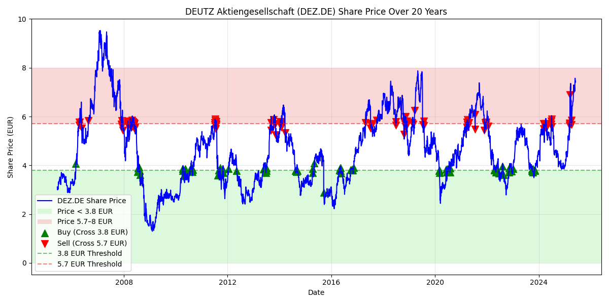

Deutz
-----

as a starting point the stock data of a German company Deutz was used.

Why?

The marketcap is very cyclical. Say history repeats itself, you can make money in buying low, selling high, multiple times!

