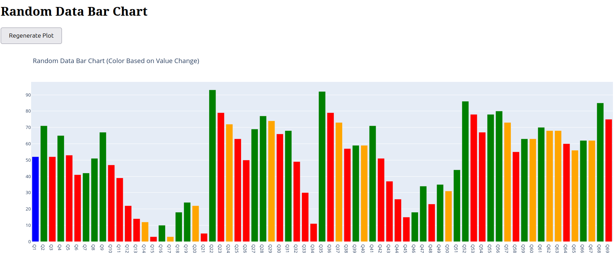

Randomizer
-----------

This is a plot of application that mimics the real curve. 
A pythonscript that states 4 times above 80% and the quarters being 7 quarters apart.

The visual plot is handy to check the performance of the script.

As I found out later, it is much easier to let an LLM describe the differences, based on the distinction have it generate a prompt to have it in another go generate a python script. 

labelling
----------  

the imporatance is labelling data, so each plot generated this way can get the label "matches pattern"
 
Training data
-------------

This method allows to train a model (keras)

Filter
------

OK, we have a model, and we can verify our real data (starting with Deutz, which should match the pattern)

